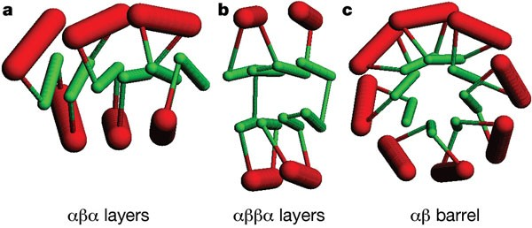

# Context Free Grammar: 
- A grammar for protein structures allows conditioning of the output of a VAR. We base grammar of Taylor's perodic table of protein structures. This considers protein structure to belong to one of three basic forms (aBa, layer, aBBa layer, aB barrel) with secondary structural elements added or removed to form individual topologies. 
- The formal context-free grammar that describes the topology strings is expressed as $$G = \{ Σ, N, P, S\}$$

- The grammar can be applied with the following symbols: 
- Non-terminal symbols: ,
N = {
    '<topology>',
    '<element>',
    '<orientation>',
    '<layer>',
    '<position>'
}

• Terminal symbols, Σ = {
    '+', '-',
    'A', 'B', 'C', 'D',
    '+0', '+1', '+2', '+3', '+4', '+5', '+6',
    '-1', '-2', '-3', '-4', '-5', '-6'
}

• Production rules, P = {
    '<topology>' → '<element><topology>',
    '<topology>' → '<element>',
    '<element>' → '<orientation><layer><position>',
    '<orientation>' → {'+', '-'} (2 rules),
    '<layer>' → {'A', 'B', 'C', 'D'} (4 rules),
    '<position>' → {'+0', '+1', '+2', '+3', '+4', '+5', '+6', '-1', '-2', '-3', '-4', '-5', '-6'} (13 rules)
}

• Start symbol, S = '<topology>'

Let's look at some simple examples of how proteins are described using topology strings:

**Example 1: Bacterial Protein (PDB ID: 2CU6)**
- **Form**: αβα (alpha-beta-alpha)
- **Topology String**: '-C+0+B+0-B-1+C-1-B-2'
- **What this means**: 
  - C and B are different layers (like building blocks)
  - + and - show the direction/orientation
  - Numbers show the position in each layer

**Example 2: Simple Alpha Helix Protein**
- **Form**: α (alpha only)
- **Topology String**: '+A+0'
- **What this means**: One alpha helix layer in positive orientation

**Example 3: Beta Sheet Protein**
- **Form**: β (beta only)  
- **Topology String**: '+B+0-B+1+B+2'
- **What this means**: Three beta strands in a sheet, each in different positions

**How We Assign These Strings:**
1. We compare each protein to known protein structures in a database called SCOP
2. We use a tool called TMAlign to measure how similar proteins are
3. If the similarity score is above 0.6 (60% similar), we assign the same topology string
4. This worked for 65% of our proteins (105,000 total)
5. We found 325 different unique topology strings in our dataset

**Why This Matters:**
- These topology strings help our computer model understand protein structure patterns
- They act like a "language" that describes how proteins are built
- The model can then learn to generate new, realistic protein structures